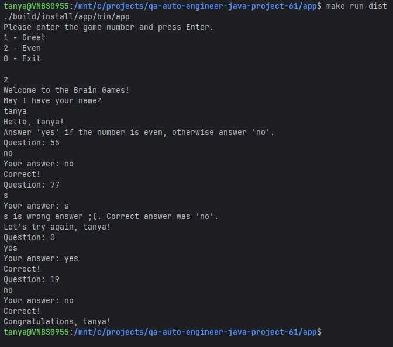
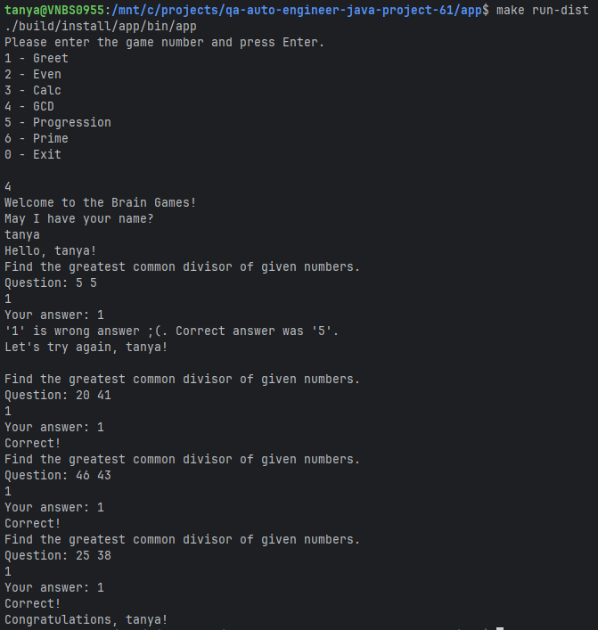
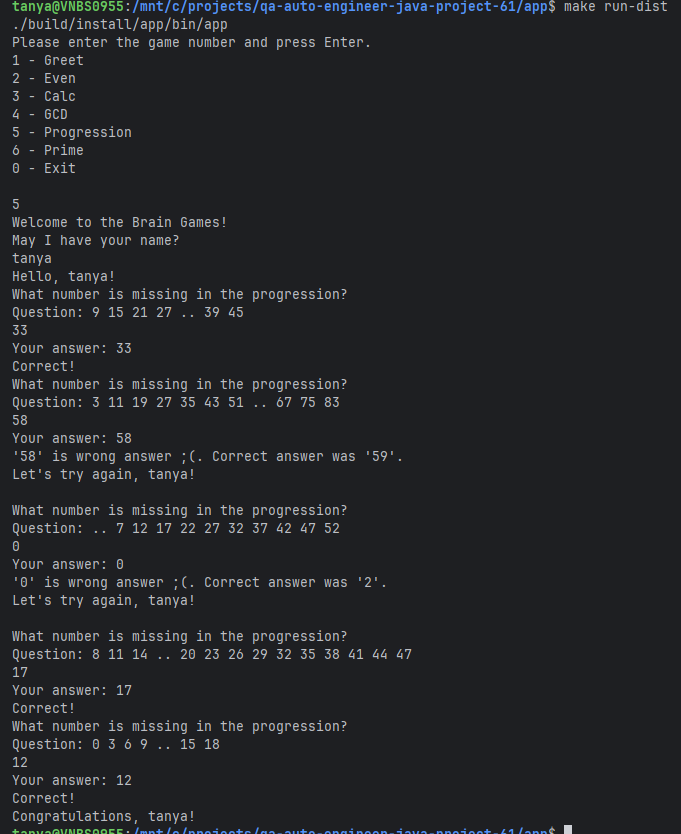
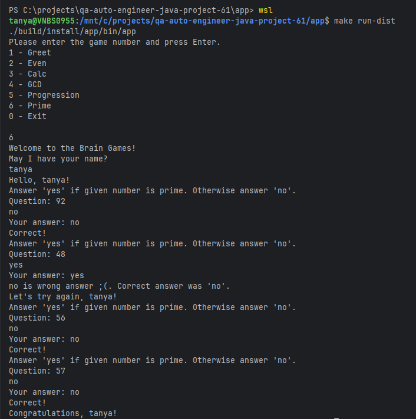

### Hexlet tests and linter status:
[](https://github.com/podolyak-tatyana/qa-auto-engineer-java-project-61/actions)
[](https://sonarcloud.io/summary/new_code?id=podolyak-tatyana_qa-auto-engineer-java-project-61)

## Описание

**Brain Games** — это коллекция математических игр для тренировки мозга, написанная на Java. Проект представляет собой консольное приложение с интерактивным меню, где пользователь может выбрать одну из нескольких игр на проверку математических знаний и логического мышления.

Каждая игра состоит из нескольких раундов, в которых игроку предлагается решить математическую задачу. Для победы необходимо правильно ответить на все вопросы подряд.

## Доступные игры

- **Greet** — приветствие и знакомство с игроком
- **Even** — определение четных и нечетных чисел
- **Calc** — решение арифметических выражений (сложение, вычитание, умножение)
- **GCD** — нахождение наибольшего общего делителя двух чисел
- **Progression** — поиск пропущенного числа в арифметической прогрессии
- **Prime** — определение простых чисел

## Требования

- **Java** 11 или выше
- **Gradle** 7.0 или выше (или используйте Gradle Wrapper, который включен в проект)

### Запуск приложения

#### Способ 1: Через Gradle Wrapper (рекомендуется)

```bash
# Windows
./gradlew run

# Linux/Mac
./gradlew run
```

#### Способ 2: Через Makefile

```bash
# Сборка и установка
make install

# Запуск
make run-dist
```

#### Способ 3: Сборка и запуск вручную

```bash
# Сборка проекта
./gradlew build

# Установка дистрибутива
./gradlew installDist

# Запуск приложения
./build/install/app/bin/app
```

### Использование

После запуска приложения вы увидите меню с номерами игр:

```
Please enter the game number and press Enter.
1 - Greet
2 - Even
3 - Calc
4 - GCD
5 - Progression
6 - Prime
0 - Exit
```

Введите номер игры (1-6) для начала игры или 0 для выхода.

## Скриншоты











## Автор

Проект создан в рамках обучения на платформе [Hexlet](https://hexlet.io).
